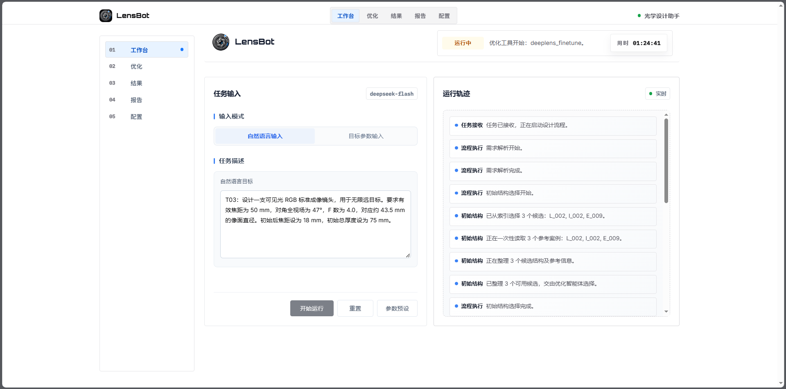

<div align="center">
  

  <p><strong>An AI agent for optical lens design, powered by large language models and DeepLens.</strong></p>
  <p>by ZJU Yang Lab</p>

  <p>
    <a href="#overview">Overview</a> ·
    <a href="#quick-start">Quick Start</a> ·
    <a href="#example-results">Results</a> ·
    <a href="#patent-application">Patent</a> ·
    <a href="#license">License</a>
  </p>

  <p>
    <a href="LICENSE"></a>
    <a href="https://www.python.org/"></a>
    <a href="https://github.com/singer-yang/DeepLens"></a>
    <a href="https://deepwiki.com/Mi-gua/LensBot"></a>
  </p>
</div>

## Overview

LensBot turns natural-language or structured optical requirements into a traceable lens-design workflow. A large language model selects reference structures, directs optimization with **DeepLens**, evaluates measured results, and produces lens files and a design report. **Zemax / OpticStudio** provides optional independent verification.

**LensBot 是面向光学镜头设计的 AI 智能体。** 输入自然语言需求或目标参数后，系统串联案例检索、初始结构选择、光学优化、指标分析与报告生成，并在本地工作台展示任务进度、智能体决策和设计结果。



*The workbench brings task input and live progress together. Separate Optimization, Results, Report and Config pages provide detailed traces, optical metrics, design reports and model settings.*

### What you can do

- **Describe a lens** with focal length, field of view, F-number and packaging requirements.
- **Start from reference cases** and let the optimization agent choose and refine a candidate structure.
- **Follow the design process** through tool calls, observations, figures and measured metrics.
- **Inspect optical performance** with available MTF, spot and distortion analyses, including optional Zemax verification.
- **Export the outcome** as lens JSON, Zemax files, layout images and a standalone HTML report.

LensBot is a research prototype. A completed run means that artifacts were delivered; optical acceptance depends on the measured results and the specified tolerances.

## How It Works

```text
Design request → Intake → Reference seeding → Agent-guided optimization
                                             ↓
                           Analysis + optional Zemax verification
                                             ↓
                              Report + artifacts + design memory
```

**DeepLens is the core optical engine behind LensBot.** Its differentiable ray tracing and lens-optimization capabilities provide the physical foundation for refining optical structures against measured objectives. LensBot builds on this foundation by turning design intent into tool-driven optimization decisions and presenting the resulting evidence in a unified workflow.

The optimization agent uses the pi runtime to choose tools and revise its strategy from observations. DeepLens handles differentiable optical optimization; LensBot coordinates the workflow, records evidence and presents the results. Reusable design lessons inform later runs.

## Quick Start

### Requirements

| Component | Requirement |
| --- | --- |
| Agent runtime | Python 3.10+ and an OpenAI-compatible model endpoint |
| Optimization agent | Node.js 24+ and the pi-coding-agent runtime |
| Optical engine | A local [DeepLens](https://github.com/singer-yang/DeepLens) installation with its Python dependencies, including PyTorch / NumPy |
| Dashboard | A local browser |
| Optional verification | Windows, licensed Ansys Zemax OpticStudio, ZOS-API and `pythonnet` |

The optical and agent runtimes must be configured before a full design run. LensBot locates DeepLens through `DEEPLENS_ROOT` or a neighboring `DeepLens/` checkout. The pi adapter first resolves `@earendil-works/pi-coding-agent` and `typebox` as Node packages, with a built sibling `pi/` workspace as its fallback.

### Launch the dashboard

From the project directory, install the basic Python dependencies:

```powershell
cd LensBot
pip install openai pyyaml matplotlib pythonnet
```

Configure the model endpoint and your API key in the current shell:

```powershell
$env:LENSBOT_OPENAI_BASE_URL="https://api.deepseek.com"
$env:LENSBOT_OPENAI_API_KEY="your-api-key"
# Set this if DeepLens is not in a neighboring checkout:
# $env:DEEPLENS_ROOT="C:\path\to\DeepLens"
python main.py
```

Open the URL printed in the terminal, usually `http://127.0.0.1:8000`. The server tries another port if it is occupied; set `LENSBOT_PORT` to choose one explicitly.

The startup model is `deepseek-flash`. `main.py` resets an inherited `LENSBOT_OPENAI_MODEL`; use the dashboard's **Config** page to select another model for a run. Keep API keys in local configuration or environment variables.

### Try a design request

> 设计一支可见光 RGB 标准成像镜头，用于无限远目标。有效焦距 50 mm，对角全视场 47°，F 数 4.0，对应约 43.5 mm 的像面直径。初始后焦距 18 mm，初始总厚度 75 mm。

Enter the request in **Workbench**, start the run, then inspect the optimization trace, results and report. Specify acceptable tolerances when you need an explicit pass/fail judgment.

## Example Results

The repository includes curated **T01–T12** examples. Each preserves the input request, final lens, measured metrics, available Zemax verification and standalone report. Start with the [results index](results/README.md), or inspect [T03's summary](results/T03/summary.md) and [HTML report](results/T03/report.html) corresponding to the request shown above. Download the report and open it in a browser to view it.

These are result snapshots, including designs with unmet or uncertain targets. Full agent transcripts, intermediate candidates and optimization checkpoints stay local; the published snapshots are not complete resumable runs.

## Development

The source entry points below cover the workflow, optimization bridge, optical tools and dashboard.

| Area | Entry point |
| --- | --- |
| Dashboard startup | `main.py` |
| Workflow | `src/agent/workflow.py` |
| Optimization bridge | `src/runtime/bridge.py`, `src/pi-agent/src/pi-sidecar.ts` |
| Optical tools | `src/tools/deeplens/`, `src/engine/zemax/` |
| Dashboard | `src/ui/` |

## Patent Application

A patent application titled **“基于大语言模型的光学镜头自主设计智能体系统及方法”** has been filed for this work. The applicant is **Zhejiang University**.

## License

LensBot's original code is licensed under the **[Apache License, Version 2.0](LICENSE)**. Third-party code, dependencies and reference data retain their respective licenses and rights; the project license does not relicense third-party material.

## Acknowledgements

- **[DeepLens](https://github.com/singer-yang/DeepLens)** provides the differentiable optics foundation and is licensed under Apache-2.0. We thank the DeepLens authors for making their optical simulation and optimization framework openly available; LensBot’s optical design workflow builds directly on their work.
- The pi-coding-agent runtime provides the optimization agent loop and is licensed under MIT.
- Ansys Zemax OpticStudio is an optional, separately licensed verification backend.
- To commemorate my undergraduate thesis project.
